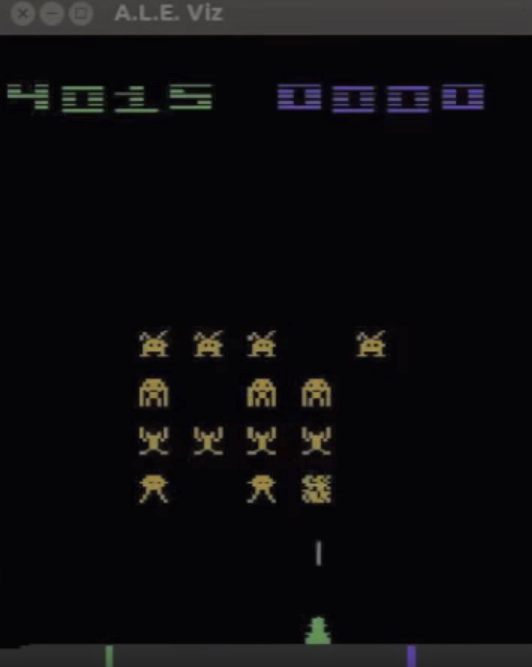
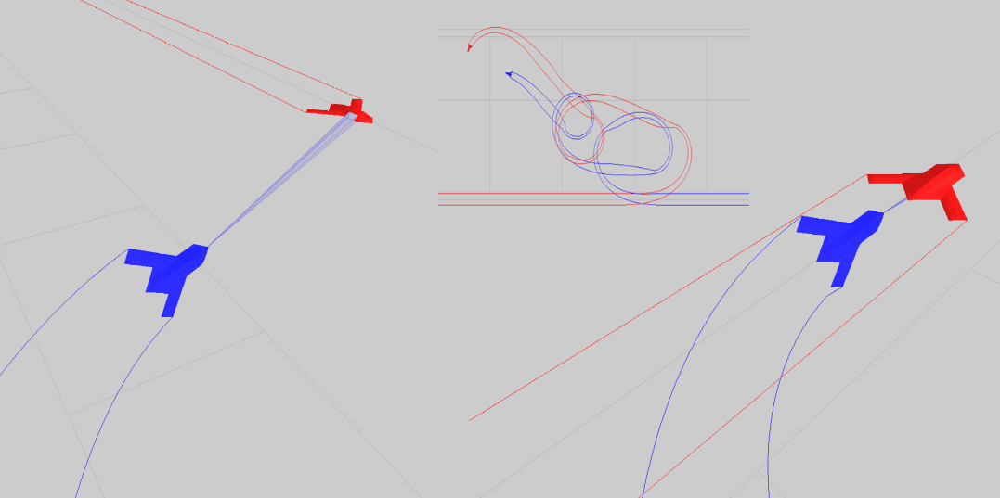
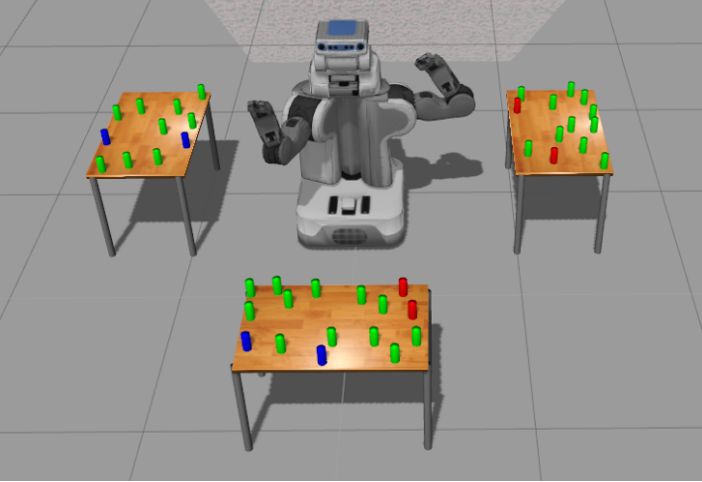

Planning searches for solutions through a general measure of state novelty. When the dynamics of the problem are given through simulator engines such as the Atari games (ALE), GVGAI, or complex robotic and UaV flight simulators, novelty exploration yields state-of-the-art performance compared to known alternatives such as MCTS. Novelty exploration can be combined as well with the exploitation of goal-based heuristics within a general Best First Width Search. BFWS can solve efficiently classical planning problems even when the action model is hidden, opening exciting opportunities to model beyond declarative action representations.

# Papers:

(Disclaimer: this is not a comprehensive list, please get in touch to add relevant work that has been missed)

## Classical Planning over STRIPS/PDDL
- Classical **Width Definition**, Iterative Width (**IW**), Serialized IW (**SIW**), **SIW+**, and **DFS+** algorithms 
   - [N. Lipovetzky and H. Geffner, ECAI12](http://people.eng.unimelb.edu.au/nlipovetzky/papers/classical-width-ecai12.pdf)
   - [PhD. Thesis, Nir Lipovetzky, 2012](https://people.eng.unimelb.edu.au/nlipovetzky/papers/aiaccess_nirlipo.pdf), [ICAPS Best dissertation Award 2013](http://www.icaps-conference.org/index.php/Main/Awards)  
   - [N. Lipovetzky and H. Geffner, ECAI14](https://people.eng.unimelb.edu.au/nlipovetzky/papers/width_ecai14.pdf)

- Best First Width Search (**BFWS**) - [N. Lipovetzky and H. Geffner, AAAI17](http://www.aaai.org/ocs/index.php/AAAI/AAAI17/paper/download/14862/14161) 
   - Polynomial BFWS planner  [N. Lipovetzky and H. Geffner, ICAPS17](http://people.eng.unimelb.edu.au/nlipovetzky/papers/icaps17-polytime-BFWS.pdf)
   - BFWS and quantified heuristic novelty measures [M. Katz, N. Lipovetzk, D. Moshkovich, A. Tuisov, ICAPS17](http://people.eng.unimelb.edu.au/nlipovetzky/papers/icaps17-quantified-novelty.pdf)

## Classical Planning over Simulator
- IW over **Atari** Simulator (ALE) 
   -  [N. Lipovetzky, M. Ramirez, and H. Geffner, IJCAI15](http://people.eng.unimelb.edu.au/nlipovetzky/papers/iw-atari-ijcai-2015.pdf)
   - [A. Shleyfman, A. Tuisov, and C. Domshlak, IJCAI16](http://www.ijcai.org/Proceedings/16/Papers/460.pdf) 
   - [Y. Jinnai and A. Fukunaga, AAAI17](http://www.aaai.org/ocs/index.php/AAAI/AAAI17/paper/download/14920/14194)  
   - [W. Banders, B. Bonet, H. Geffner, AAAI18](https://arxiv.org/pdf/1801.03354) 
   
## MDP over Simulators
- IW over **General Videogame** Competition (GVGAI) - [T. Geffner and H. Geffner, AAIDE15](http://www.aaai.org/ocs/index.php/AIIDE/AIIDE15/paper/download/11540/11350)

## Planning over Factored Simulators in Functional STRIPS
- BFWS with **simulators** and **Functional STRIPS** (FSTRIPS) - [G. Frances, M. Ramirez, N. Lipovetzky, and H. Geffner, IJCAI17](http://people.eng.unimelb.edu.au/nlipovetzky/papers/ijcai17-planning-with-simulators.pdf)
- **Task and Motion** Planning - [J. Ferrer-Mestres, G. Frances, and H. Geffner, ARXIV17](https://arxiv.org/pdf/1706.06927.pdf) 
- UaV **Hybrid Control** - [M. Ramirez, M. Papasimeon, N. Lipovetzky, L. Benke, T. Miller, A. Pearce, E. Scala, M. Zamani, AAMAS18](https://people.eng.unimelb.edu.au/nlipovetzky/papers/aamas18-uav.pdf)
- BFWS online POMDP for **Transparent Planning** - [A. MacNally, N. Lipovetzky, M. Ramirez, A. Pearce, AAMAS18](https://people.eng.unimelb.edu.au/nlipovetzky/papers/aamas18-transparent-planning.pdf)

# Demo Videos
- [Youtube Atari videos](https://www.youtube.com/playlist?list=PLXpQcXUQ_CwenUazUivhXyYvjuS6KQOI0)

# Simulators screenshots

